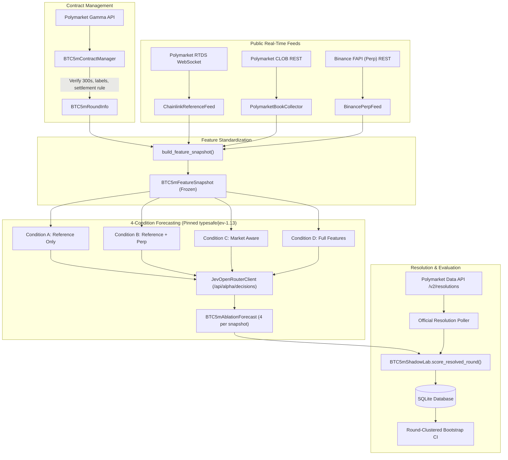

# BTC 5-Minute Prospective Forecasting Research Laboratory

## 1. Executive Summary & Scientific Motivation

Phase 6 introduces a prospective **BTC 5-minute prediction-market forecasting laboratory** within the WS-Jev research system. While Phase 5 evaluated TypeSafe Jev (`typesafe/jev-1.13`) across general prospective Polymarket contracts that require days or weeks to resolve, BTC 5-minute markets (`btc-updown-5m-{epoch}`) provide an ultra-high-velocity, high-resolution testbed:

* **288 resolved markets per 24-hour cycle** (versus 1–3 general event resolutions).
* **Strictly unambiguous resolution rules**: settlement is governed deterministically by Chainlink's 60-second TWAP stream (`btc-usd-twap-60s-streams`) evaluated against the opening boundary price-to-beat.
* **Standardized forecasting horizons**: predictions are collected at fixed intervals ($240\text{s}, 180\text{s}, 120\text{s}, 60\text{s}, 30\text{s}$ before round expiration).
* **Point-in-time synchronization**: every observation is frozen into an immutable point-in-time snapshot with millisecond timestamp verification.

### Strict Research-Only Contract

This laboratory is designed strictly for **forecasting evaluation and quantitative research**:

* **Zero live trading**: no wallets, private keys, transaction signing, or exchange execution.
* **Zero paper trading in Phase 6**: no order generation, simulated fills, position sizing, or portfolio mutation. Jev operates in pure shadow mode.
* **Zero credential leakage**: `OPENROUTER_API_KEY` is loaded exclusively from the process environment and never written to disk, database, logs, or reports.
* **Clean-room implementation**: based conceptually on research ideas from `frankda/jev-poly-crypto-demo` (`6d73b1b52cef3a8bf61e8a260ff5e7e4857af296`), but with 100% independent Python architecture and zero copied code (see [`docs/EXTERNAL_REFERENCE_REVIEW.md`](EXTERNAL_REFERENCE_REVIEW.md)).

---

## 2. Laboratory Architecture

The laboratory orchestrates five isolated components into a unified research loop:



---

## 3. Subsystem Specifications

### 3.1. Contract Manager (`contract.py`)
* **Slug Derivation**: `btc-updown-5m-{epoch_start}` where `epoch_start = (now // 300) * 300`.
* **300-Second Duration Validation**: Verifies that $(T_{\text{end}} - T_{\text{start}}) == 300$ seconds. Rejects contracts with non-standard durations with `SKIP_NON_300S_DURATION`.
* **String-Label Outcome Mapping**: Explicitly matches outcome strings `"Up"` and `"Down"` to indices; never assumes token order.
* **Authoritative Price-to-Beat**: Extracted from `eventMetadata.priceToBeat` or determined via exact opening boundary tick from Chainlink TWAP stream.
* **Settlement Source Verification**: Validates that `resolutionSource` contains Chainlink TWAP 60s stream coordinates (`data.chain.link/streams/btc-usd-twap-60s-streams`).

### 3.2. Chainlink Reference Feed (`reference_feed.py`)
* **Streaming Consumer**: Subscribes to Polymarket RTDS (`wss://ws-live-data.polymarket.com`) for `crypto_prices_chainlink` and `crypto_prices_twap_sixty`.
* **Clock-Skew Buffer**: Accepts ticks with timestamp $\le \text{now} + 2000\text{ms}$; rejects future ticks beyond tolerance.
* **Opening Boundary Detection**: Matches tick within 3,000ms of round start epoch to anchor the round baseline.
* **Returns & Basis Points**: Computes distance to beat in basis points:
  $$\text{dist\_bps} = \left(\frac{P_{\text{current}}}{P_{\text{beat}}} - 1.0\right) \times 10{,}000$$
  and momentum returns over $10\text{s}$, $30\text{s}$, and $60\text{s}$ windows.

### 3.3. Polymarket CLOB Order Book (`poly_book.py`)
* **Public Read-Only Endpoint**: `GET https://clob.polymarket.com/book?token_id=...` with zero authentication headers.
* **Book Invariants**: Bids sorted descending by price; asks sorted ascending by price. Rejects crossed books ($\text{bid} \ge \text{ask}$) with `CROSSED_ORDER_BOOK`.
* **Binary Complementarity Synthesis**: Leverages $P_{\text{UP}} + P_{\text{DOWN}} = 1.0$:
  * Effective UP bids combine native UP bids and $1.0 - \text{best\_ask}_{\text{DOWN}}$.
  * Effective UP asks combine native UP asks and $1.0 - \text{best\_bid}_{\text{DOWN}}$.
* **Market Consensus Probability ($market\_q$)**:
  $$market\_q = \frac{\text{eff\_bid}_{\text{UP}} + \text{eff\_ask}_{\text{UP}}}{2.0}$$

### 3.4. Binance Perpetual Microstructure Feed (`binance_feed.py`)
* **Public Unauthenticated Endpoints**: `GET https://fapi.binance.com/fapi/v1/depth?symbol=BTCUSDT&limit=20` and `/aggTrades?symbol=BTCUSDT&limit=1000`.
* **Top-5 and Top-20 Depth Imbalance**:
  $$\text{imbalance}_K = \frac{\sum_{i=1}^K Q_{\text{bid},i} - \sum_{i=1}^K Q_{\text{ask},i}}{\sum_{i=1}^K Q_{\text{bid},i} + \sum_{i=1}^K Q_{\text{ask},i}} \in [-1.0, 1.0]$$
* **Microprice Offset**:
  $$\text{microprice} = \frac{P_{\text{bid}} \cdot Q_{\text{ask},1} + P_{\text{ask}} \cdot Q_{\text{bid},1}}{Q_{\text{bid},1} + Q_{\text{ask},1}}$$
  $$\text{offset\_bps} = \left(\frac{\text{microprice} - P_{\text{mid}}}{P_{\text{mid}}}\right) \times 10{,}000$$
* **Taker Flow Invariant**: Aggregates aggressor buy volume ($m = \text{False}$) versus aggressor sell volume ($m = \text{True}$) over $10\text{s}$, $30\text{s}$, and $60\text{s}$. If historical trades do not span the full window, returns `None` (never fabricating a false $0.0$).
* **Basis vs Reference**: Measures basis points discrepancy between Binance perp mid and Chainlink settlement price.

### 3.5. Feature Snapshot (`snapshot.py`)
* **Timing Deviation Control**: Calculates deviation from scheduled horizon ($\text{captured\_at\_ms} - \text{target\_scheduled\_ms}$). Rejects snapshots where $|\text{drift}| > 3500\text{ms}$ with `SKIP_EXCESSIVE_TIMING_DRIFT`.
* **Data Quality Verification**: Validates all inputs before triggering inference. Records standard skip reasons:
  * `SKIP_NO_EXACT_ANCHOR`: Missing or non-positive price-to-beat.
  * `SKIP_STALE_REFERENCE`: Reference tick age $> 30\text{s}$.
  * `SKIP_MISSING_MARKET_Q`: Empty order books or invalid consensus odds.
  * `SKIP_INVALID_PERP`: Crossed or empty Binance order book.

---

## 4. The 4 Experimental Ablation Conditions

To scientifically isolate whether LLM forecasting edge arises from market consensus conditioning or genuine independent fundamental analysis, every frozen snapshot is evaluated across four conditions:

| Condition Identifier | Reference Feed & Rule | Binance Perp Microstructure | Polymarket Consensus Odds | Hypothesis Tested |
| :--- | :---: | :---: | :---: | :--- |
| `BTC5M_REFERENCE_ONLY` | **YES** | NO | NO | Can Jev estimate settlement probability from the price trajectory alone without seeing odds? |
| `BTC5M_REFERENCE_PLUS_PERP` | **YES** | **YES** | NO | Does high-frequency order flow and depth imbalance improve LLM accuracy over raw spot? |
| `BTC5M_MARKET_AWARE` | **YES** | NO | **YES** | Does Jev simply anchor to the Polymarket order book, or can it detect market mispricings? |
| `BTC5M_FULL` | **YES** | **YES** | **YES** | Does combining all information sources produce superior calibration and lower log loss? |

### Structured Inference Invariant

All conditions use pinned `typesafe/jev-1.13` via OpenRouter's `/api/alpha/decisions` schema. The model is asked exclusively:

> *"Will this BTC 5-minute prediction market resolve UP under the official resolution rule? Evaluate the probability that the official reference price at round settlement is >= priceToBeat. Focus solely on objective, calibrated probability estimation without external bias."*

Prompt payloads are strictly probability questions: no trading recommendations, no bet sizing, no order placement, and no bankroll references.

---

## 5. Statistical Methodology & Clustered Bootstrapping

### 5.1. Evaluation Metrics
For each observation $i$ with forecast probability $p_i \in [0, 1]$ and binary outcome $y_i \in \{0, 1\}$ ($1 = \text{UP}, 0 = \text{DOWN}$):

* **Brier Score**:
  $$\text{Brier} = (p_i - y_i)^2$$
* **Logarithmic Loss** (clipped to $\epsilon = 10^{-6}$):
  $$\text{LogLoss} = -\left[y_i \ln(p_i) + (1 - y_i)\ln(1 - p_i)\right]$$
* **Delta vs Market Baseline**:
  $$\Delta \text{Brier} = \overline{\text{Brier}}_{\text{Jev}} - \overline{\text{Brier}}_{\text{Market}}$$
  A negative $\Delta \text{Brier}$ indicates that Jev achieved higher accuracy than the raw market consensus.

### 5.2. Round-Clustered Bootstrap Resampling
Because multiple standardized horizons ($240\text{s}, 180\text{s}, 120\text{s}, 60\text{s}, 30\text{s}$) within the same 5-minute round share the identical settlement outcome, standard i.i.d. bootstrap resampling would underestimate standard errors and produce spuriously tight confidence intervals.

The laboratory implements **round-clustered bootstrap resampling** ($B = 1000$ iterations):
1. Clusters are defined by unique `round_slug`.
2. Entire rounds (including all horizons for that round) are resampled with replacement.
3. $\Delta \text{Brier}$ and $\Delta \text{LogLoss}$ are computed for each replicate.
4. Empirical 2.5% and 97.5% quantiles define the 95% cluster-robust confidence interval.

---

## 6. CLI Operation & Verification

### 6.1. Probing Live Connectivity
Verify public read-only connectivity and OpenRouter authentication:
```bash
uv run pmr btc5m-probe
```

Example output:
```text
================================================================================
  [!] PROBING BTC 5-MINUTE DATA FEEDS & JEV CONNECTIVITY
================================================================================
  Polymarket Gamma API (Active Round):  PASS
  Polymarket Book:                      PASS
  Binance USD-M Perpetual (FAPI):       PASS
  OpenRouter TypeSafe Jev API Key:      PASS

  Probe Details:
    - active_round: {'slug': 'btc-updown-5m-1790103900', 'price_to_beat': None, 'seconds_remaining': 116.4}
    - market_q: 0.87
    - poly_spread: 0.01
    - binance_mid: 86430.45
    - binance_spread_bps: 0.012
    - binance_microprice_offset: -0.005
    - openrouter_key_present: True
================================================================================
```

### 6.2. Executing Prospective Shadow Rounds
Monitor live 5-minute rounds and capture snapshots across all standard horizons:
```bash
uv run pmr btc5m-shadow --rounds 6
```

Options:
* `--rounds N`: Number of consecutive 5-minute rounds to observe (default: 1).
* `--horizons`: Custom horizons remaining in seconds (e.g. `--horizons "180,60,30"`).
* `--no-poll-resolution`: Skip waiting for official resolution after round close.
* `--bypass-cache`: Bypass local OpenRouter response caching.

### 6.3. Viewing Research Status
Inspect discovered rounds, captured snapshots, and prospective forecasts:
```bash
uv run pmr btc5m-status
```

### 6.4. Generating Ablation Benchmark Reports
Compute comparative metrics and cluster-robust bootstrap confidence intervals against the market baseline:
```bash
uv run pmr btc5m-report
```

---

## 7. Safety Invariants & Verification Checklist

1. **No Live Execution**: No code paths instantiate wallets, private keys, transaction signing, or exchange submission.
2. **No Live Execution Abstractions**: No abstract base classes or broker interfaces intended for future live substitution.
3. **PaperBroker Sole Execution Simulator**: Isolated from Phase 6; Phase 6 performs zero order placement.
4. **Environment-Only API Key**: `OPENROUTER_API_KEY` is never written to disk, database, or logs.
5. **Model Pinning**: Pinned strictly to `typesafe/jev-1.13`. Fallbacks to `jev-latest` are prohibited and blocked by safety verification.
6. **Automated Verification**:
   ```bash
   uv run pmr verify-safety
   ```
   Must yield `SAFETY VERIFICATION RESULT: PASS` on all 8 rules.
